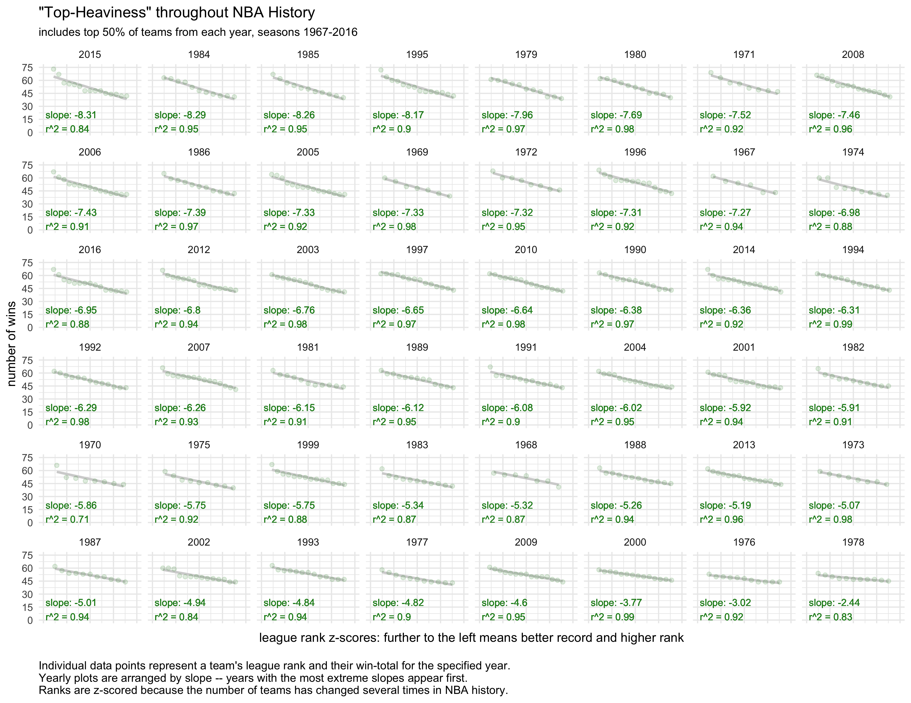
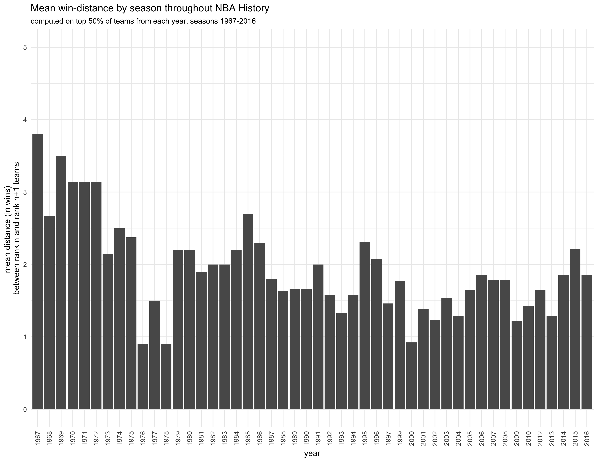
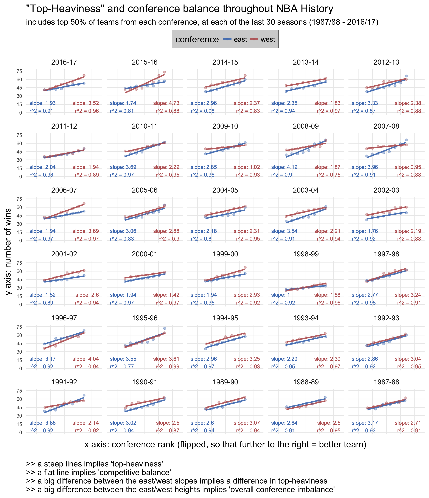

```{r setup, include=FALSE}
# set global knitr chunk options 
knitr::opts_chunk$set(
  echo=FALSE, warning=FALSE, message=FALSE, include=FALSE, eval=FALSE,
  fig.width=12, fig.height=9.5
)

# load dependencies
library("dplyr"); library("magrittr"); library("ggplot2"); library("reshape2")

# set ggplot2:: theme
theme_set(theme_minimal(14))
```

Questions: 

1. Is the NBA more "top-heavy" now than it has been throughout its history?
2. Are the conferences more "imalanced" than they have been throughout history?

Requires an answer to each of these questions first: 

1. What does it mean for the NBA to be "top-heavy"? 
2. What does it mean for the NBA to have "competitive balance" between and within the conferences? 

We'll look at the last 30 years of NBA seasons, including only the top 50% of teams in each conference (what the bottom is like doesn't seem relevant to the question of "top-heaviness"). We'll use scaled ranks for the teams within a conference, to facilitate comparison across years (since the NBA has added teams several times in recent decades). 


```{r load_and_prep}
# load data + functions +c
source("load_prep_data_functions.r")

top_prop <- 1
# load and clean up data, using top_prop of teams per season to compute on
dat <- load_prep_data(top_prop=.5, toss_lockout=FALSE, rank_years_by_slope=FALSE, split_by_conf=FALSE, cut_to_three_decades=TRUE, flip_ranks=FALSE)

```


```{r}
# get a summary by years
(dat_years <- dat %>% group_by(year) %>% summarize(
  num_teams  = length(unique(team)),
  best_team  = paste0(team[wins==max(wins)], collapse="|"), 
  worst_team = paste0(team[wins==min(wins)], collapse="|"), 
  best_rec   = max(wins), 
  median_rec = median(wins),
  worst_rec  = min(wins),
  slope      = unique(slope), 
  r_squared  = unique(r_squared)
)) %>% 
  arrange(slope) %>% 
  filter(as.character(year) > "1985") %>% 
  knitr::kable(digits=3)


```


### measuring 'top-heaviness' across NBA seasons

#### linear models for `wins ~ rank` across NBA seasons (top 50% of teams)

<br><br>

```{r}
xlab      <- "league rank z-scores: " %+% 
             "further to the left means better record and higher rank\n" 
ylab      <- "number of wins"
ptitle    <- '"Top-Heaviness" throughout NBA History'
psubtitle <- paste0(
  "includes top ", top_prop*100, "% of teams from each year, seasons ", 
  min(as.character(dat$year)), "-", max(as.character(dat$year))
)
pcaption  <- 
  "Individual data points represent a team's league rank and their "         %+%
  "win-total for the specified year. \nYearly plots are arranged by slope "  %+%
  "-- years with the most extreme slopes appear first. \nRanks are z-scored" %+%
  " because the number of teams in the league has changed several times in NBA history."

# plot wins by rank for each year
ggplot(dat, aes(x=rank_scaled, y=wins)) + 
  geom_smooth(method="lm", se=FALSE, color="lightgray") + 
  geom_point(alpha=.3, color="forestgreen") + 
  facet_wrap(~year, ncol=8) + 
  scale_x_continuous(limits=c(-2, 2)) + 
  scale_y_continuous(limits=c(0, 75), breaks=seq(0, 75, 15)) + 
  geom_text(aes(
    label=paste0(
      "slope: ", round(slope, 2), "\n", "r^2 = ",  round(r_squared, 2)
    ), x=-1.9, y=0
  ), vjust=0, hjust=0, size=3.5, color="forestgreen") + 
  labs(x=xlab, y=ylab, title=ptitle, subtitle=psubtitle, caption=pcaption) + 
  theme(plot.caption=element_text(hjust=0), 
        axis.text.x=element_blank(),
        axis.text.y=element_text(size=8),
        panel.grid.minor=element_blank())
```


<!-- SAME PLOT, BUT THIS TIME ORDERED CHRONOLOGICALLY -->
```{r include=FALSE, eval=FALSE}
dat2 <- dat %>% mutate(year = ac(year)) %>% 
  mutate(year = factor(year, levels=ac(rev(sort(as.numeric(unique(year)))))))
# plot wins by rank for each year
ggplot(dat2, aes(x=rank_scaled, y=wins)) + 
  geom_smooth(method="lm", se=FALSE, color="lightgray") + 
  geom_point(alpha=.3, color="forestgreen") + 
  facet_wrap(~year, ncol=8) + 
  scale_x_continuous(limits=c(-2, 2)) + 
  scale_y_continuous(limits=c(0, 75), breaks=seq(0, 75, 15)) + 
  geom_text(aes(
    label=paste0(
      "slope: ", round(slope, 2), "\n", "r^2 = ",  round(r_squared, 2)
    ), x=-1.9, y=0
  ), vjust=0, hjust=0, size=3.5, color="forestgreen") + 
  labs(x=xlab, y=ylab, title=ptitle, subtitle=psubtitle, caption=pcaption) + 
  theme(plot.caption=element_text(hjust=0), 
        axis.text.x=element_blank(),
        axis.text.y=element_text(size=8),
        panel.grid.minor=element_blank())
```



<br><br><br><br>

#### plotting the slopes of `wins ~ rank` across NBA seasons 

<br><br>

[STILL NEED TO CHECK THE CODE AND ADD ANNOTATIONS BEFORE INCLUDING THIS PLOT]

```{r}
# plot the slopes for each year
ggplot(dat_years, aes(x=as.character(year), y=-slope)) + 
  geom_bar(stat="identity") + 
  theme(axis.text.x=element_text(angle=90, hjust=1, vjust=.5))
```


<br><br><br><br>


```{r}
# compare lagged win totals/pct by year 
dat <- dat %>% 
  mutate(year = ac(year)) %>% arrange(desc(year), rank) %>% group_by(year) %>% 
  mutate(lagged_wins = wins - lag(wins, order_by=-rank)) %>% ungroup()

ggplot(dat, aes(x=rank, y=lagged_wins)) + geom_line() + facet_wrap(~year)
```

```{r}
dat_lag <- dat %>% group_by(year) %>% summarize(
  num_teams = unique(num_teams),
  mean_lagwins   = mean(lagged_wins, na.rm=TRUE),
  median_lagwins = median(lagged_wins, na.rm=TRUE)
)

dat_years <- dat_years %>% 
  left_join(dat_lag, by=c("year", "num_teams")) %>% 
  arrange(desc(mean_lagwins))
```


```{r eval=FALSE}
knitr::kable(dat_years, digits=3)
```


#### mean lagged difference between rank-adjacent teams across seasons

<br><br>

```{r}
# set a reasonable ymax
ymax <- dat_lag$mean_lagwins %>% max %>% ceiling

ggplot(dat_lag, aes(x=year, y=mean_lagwins)) + 
  geom_bar(stat="identity") +
  labs(x="year", 
       y="mean distance (in wins) between rank n and rank n+1 teams",
       title='Mean win-distance by season throughout NBA History', 
       subtitle=paste0(
         "computed on top ", top_prop*100, 
         "% of teams from each year, seasons ", 
         min(as.character(dat$year)), "-", max(as.character(dat$year))
       )) + theme(axis.text.x=element_text(angle=90, hjust=1, vjust=.5)) + 
  scale_y_continuous(limits=c(0, ymax), breaks=seq(0, ymax, 1))
```



<br><br><br><br>


### competitive balance between conferences

<br><br>

```{r reset, echo=FALSE, eval=TRUE, include=TRUE}
knitr::opts_chunk$set(include=TRUE, eval=TRUE, echo=FALSE)

# load dependencies
# library("dplyr"); library("magrittr"); library("ggplot2"); library("reshape2")

# set ggplot2:: theme
theme_set(theme_minimal(14))

# load data + functions +c
source("load_prep_data_functions.r")

top_prop <- .5

dat <- load_prep_data(
  top_prop=top_prop, toss_lockout=FALSE,
  rank_years_by_slope=FALSE, split_by_conf=TRUE, cut_to_three_decades=TRUE
)
# format the season titles
dat$year <- ac(dat$year)

suffix <- strsplit(dat$year, "") %>% 
  lapply(function(x) paste0(x[3:4], collapse="")) %>% unlist() %>% 
  (function(x) sprintf("%02s", ifelse(x=="99", "00", ac(as.numeric(x)+1))))


dat$year <- paste0(dat$year, "-", suffix)

years_ordered <- dat$year %>% unique() %>% sort(decreasing=TRUE)

dat$year <- factor(dat$year, levels=years_ordered)

```


```{r, eval=TRUE, include=TRUE}

# 

# START HERRRRE 
#
#   ADD SPLIT BY CONF ABILITY TO load_prep_data()
#   ADD SPLIT BY CONF ABILITY TO load_prep_data()
#   ADD SPLIT BY CONF ABILITY TO load_prep_data()
# 
#   -- SPLIT BY CONF
#   -- SWAP LEFT/RIGHT SO SLOPE IS POSITIVE
#   -- COLOR SO WEST=RED, EAST=BLUE
#   -- CHANGE TEXT ETC
#   -- 5COLS, 6ROWS, 30YRS
#   -- EAST/WEST ON EACH PANEL SEPARATE LINES


xlab      <- "x axis: conference rank (flipped, so that further to the right = better team)\n"
ylab      <- "y axis: number of wins"
ptitle    <- '"Top-Heaviness" and conference balance throughout NBA History'
psubtitle <- paste0(
  "includes top ", top_prop*100, "% of teams from each conference, ", 
  "at each of the last 30 seasons (1987/88 - 2016/17)" 
  # min(as.character(dat$year)), "-", max(as.character(dat$year)), ")"
)
pcaption  <- 
  ">> a steep lines implies 'top-heaviness' \n" %+%
  ">> a flat line implies 'competitive balance' \n" %+%
  ">> a big difference between the east/west slopes implies a difference in top-heaviness\n" %+%
  ">> a big difference between the east/west heights implies 'overall conference imbalance'"
  # ">> Individual data points represent a team's conference rank and their " %+%
  # "win-total for the specified year. " %+% 
  # "\n>> Yearly plots are arranged by " %+% 
  # "absolute difference in slope between the conferences "  %+%
  # "-- the most 'unbalanced' years appear first. " #%+%
  # "\n>> Conference ranks are z-scored" %+%
  # " because the total number of teams in the league has changed " %+% 
  # "several times in NBA history."

# dat$rank_conf <- -dat$rank_conf
# plot wins by rank for each year
colz <- c("#4b7cbc", "#bc6262") # blue then red
ggplot(dat, aes(x=rank_conf_scaled, y=wins, group=conference, color=conference)) + 
  # geom_smooth(method="lm", se=FALSE) + 
  geom_line(stat="smooth", method = "lm", size=1, alpha=.9) + 
  scale_color_manual(values=colz) + 
  geom_point(alpha=.4) + 
  facet_wrap(~year, ncol=5) + 
  scale_x_continuous(limits=c(-2.5, 2.5)) + 
  scale_y_continuous(limits=c(0, 75), breaks=seq(0, 75, 15)) + 
  geom_text(aes(
    label=paste0(
      "slope: ", round(slope_conf, 2), "\n", "r^2 = ",  round(r_squared_conf, 2)
    ), x=ifelse(conference=="east", -2.5, 2.5), y=ifelse(conference=="east", 0, 0),#75
    hjust=ifelse(conference=="east", 0, 1), vjust=ifelse(conference=="east", 0, 0)#1 
  ), size=3, show.legend=FALSE) + 
  labs(x=xlab, y=ylab, title=ptitle, subtitle=psubtitle, caption=pcaption) + 
  theme(plot.caption=element_text(hjust=0), 
        axis.text.x=element_blank(),
        axis.text.y=element_text(size=8),
        panel.grid.minor=element_blank(), 
        legend.position="top", legend.justification=.5, 
        legend.box.background=element_rect(fill="lightgray"))

ggsave(filename="byconf4.pdf", width=9.5, height=11, units="in")
ggsave(filename="byconf4.png", width=9.5, height=11, units="in")

```


<link rel="stylesheet" type="text/css"
href="https://fonts.googleapis.com/css?family=Open+Sans:300,400,400i,700">

<link href="https://fonts.googleapis.com/css?family=Roboto+Mono:300,400,500" rel="stylesheet">

<style>

body {
  max-width: 1400px;
  margin: auto;
  padding: 1em;
  font-family: 'Open Sans', sans-serif;
}   

code {
  font-family: 'Roboto Mono', monospace;
  font-size: 14px;
}

pre {
  font-family: 'Roboto Mono', monospace;
  font-size: 14px;
}

</style>

